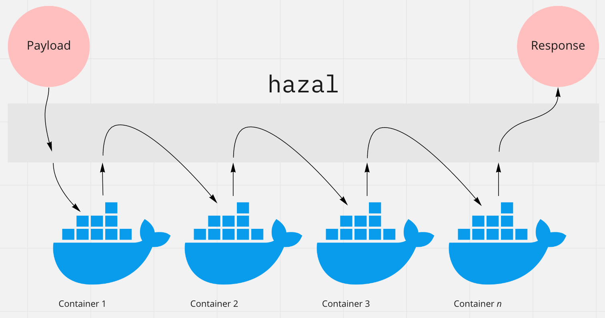

# hazal🧙‍♀️

[AWS Sagemaker](https://aws.amazon.com/sagemaker/) relies on docker containers for its pipelines.
This means it's possible to create custom containers using e.g. other languages than Python or algorithms not available off-the-shelf in AWS.
Even though it's easy to test each container in isolation, it is harder to test the whole pipeline in one go.
`hazal` helps by orchestrating the communication between containers.

The usual disclaimers of beta-quality software apply.



## Usage

You need to install `janet` on your machine first.

`hazal` expects a configuration file with the following structure, where each struct is a container. Order is important:
```clojure
[{:type "single"               # type of container: single or multi-model
  :container "sagemaker-pre"}  # name of the container (docker run --name ...)
{:type "multi"
 :container "sagemaker-inf"}]
```

Such a file could live in the main repository of a project e.g. where models are trained locally. 
I call mine `containers.jdn`, but it doesn't really matter.
Then, to use `hazal` and test the pipeline:
- Launch the docker containers (`hazal` won't do this for now)
- Launch `hazal` with `janet main.janet <path to config>` (or build the binary with `jpm build`)
- `POST` the payload expected by the first sagemaker container to `localhost:9001/pipeline`, or wherever `hazal` is running
- If you are using a multimodel container in the pipeline, specify which model to use for the prediction with a query parameter `localhost:9001/pipeline?model=allseeingeye`

## TODO

- [x] Define configuration structure
- [x] Chain an arbitrary number of containers
- [x] Differentiate between single and multi-model containers
- [x] Send request to load model, if necessary
- [x] Inform if the model does not exist
- [x] Get host and port from `docker ps`
- [ ] If a container fails, pass the response and inform which step failed
- [ ] Manage docker containers on-demand

## See also
- [MultiModel server in R](https://github.com/jcpsantiago/sagemaker-multimodel-R)
- [MultiModel server in Clojure](https://github.com/jcpsantiago/sagemaker-multimodel-clj)
